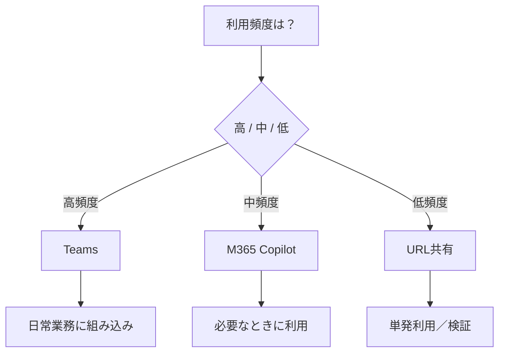

## エージェントへのアクセス方法
共有したエージェントへのアクセス方法を設定、周知します。

### ■ 判断軸（社内利用前提）

| 観点 | チェック内容 | 意味 |
|------|--------------|------|
| 利用頻度 | 毎日 / 時々 / 単発 | 業務組み込み度合い |
| 利用状況 | 業務中 / ナレッジ検索 / 問い合わせ | どの画面で使うべきか |
| UI要件 | 標準UI / カスタムUI | どこまでUXを作り込むか |
| ガバナンス | 厳格 / 緩い | DLP・認証制御の重要性 |

### 推奨チャネル選択マップ（社内利用）  

| 利用シナリオ | 推奨チャネル | 理由 | 注意点 |
|--------------|-------------|------|--------|
| PoC / 検証 | URL共有 | 即使える・配布しやすい | 認証設定ミスで全公開に近い状態になる可能性 |
| 限定ユーザー提供 | 特定ユーザー共有 + URL | 制御しながら展開可能 | 権限付与ミス注意 |
| 社内標準利用 | M365 Copilot | シームレス・教育不要 | 埋もれやすい |
| 日常業務（高頻度） | Teams | 常用UI・定着しやすい | チャネル乱立に注意 |
| ナレッジ活用 | SharePoint | 文書と一体化 | 権限設計ミス＝情報露出 |
| 社内ポータル埋め込み | SharePoint（埋め込み） | UI統合できる | governance設定必要 |  　　

### アクセス共有手法一覧  

| 共有方法 | 簡易手順 | 特徴 | 注意点 |
|----------|-------------|------|--------|
| URL共有 | ① エージェントを開く ② 「共有」クリック ③ 「リンクコピー」 ④ Teams/メールで配布 | 最初の展開手段 | 誰に共有されたか管理しづらい |
| 特定ユーザー共有 | ① 「共有」 ② 「特定ユーザー」選択 ③ ユーザー指定 ④ 適用 | 安全に展開できる | ユーザー追加漏れに注意 |
| M365 Copilot | ① エージェント公開 ② Copilot内で表示 ③ 利用者が選択 | 標準UI | 見つけにくい |
| Teams公開 | ① ChannelsでTeams選択 ② 公開 ③ Teamsで利用 | 日常業務に最適 | 運用設計が必要 |
| SharePoint連携 | ① ChannelsでSharePoint設定 ② サイト選択 ③ Deploy | 文書と統合 | サイト権限に依存 |
| SharePoint埋め込み | ① Web appでURL取得 ② SharePointページ編集 ③ Embed貼付 | UI一体化 | iframe制御が必要 |
> [!NOTE]
> 各詳細手順はCopilotで確認してください。  

### チャネル選定フロー（利用頻度ベース）

-----
この演習はこれで終了です。

